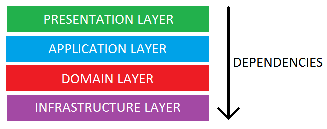

# cqrs Architecture

## How to use

Pre-requisites:

* symfony cli
Run:
```bash
curl -sS https://get.symfony.com/cli/installer | bash
```
* docker for mac
Run:
```bash
brew install docker
```

* Install php and extension
```bash
brew install php
pecl install redis
```

Launch everything

```bash
make install
make up
```

### Misc
```bash
make #will list all the target
```

Add proxy in your .bash_profile or .zshenv:

```bash
export HTTPS_PROXY="localhost:7080"
```

Add the proxy in osx settings:


## Access

`http://localhost:7080/ for proxy access`

* API: 
* API-DOCS: 

## Layered architecture



# Domain

The Business/Domain Logic Layer is the core of your system. 
All your business models and services are defined here.
This layers hold the rules and logic of the business. 
It’s the most important layer of your system.

# Application

The application layer is what holds everything together. 
It coordinates the objects and services of your application. 
Its the interface between your business logic and presentation. 
Application services represents how the application is driven.

This layer is also responsible for coordinating your domain objects and domain services to interact with internal or external services. 
For example sending an email when an invoice is approved, should be orchestrated in this layer. 
The domain layer is not responsible for initiating communication with external services.

# Presentation

The Presentation or UI layer are your views, templates, controllers and forms. 
This is the interface to the outside world. 
Here we provide the interface for the users. 
Everything a consumer of our system sees, is presentation. 
This can be a web page or a Restful API. 

# Infrastructure

The infrastructure layer holds the most low level code. 
The interactions with a database or an outside service like emails or messaging queues (sending the actual queue or email).


# Domain Event

Usually used in DDD architecture but it's possible to add it to your architecture if the domain layer is the most important

Domain Event is dispatched after a change in your Domain has happened. When a new product was created, or a user was registered. It’s always related to something that is important to the business.

Application Events, on the other hand, are events between components inside the core of your application. This allows the decoupling of components. If component A needs to trigger something in component B. Then A should dispatch an event that B listens on. If you, for example, want the stock to be decreased in the stock component whenever someone orders something in the Order component. Then the Order component should dispatch a DecreaseStock event. These application events are thus used to decouple the communications between components in a monolithic system or between micro-services.

You can also have infrastructure events. These can be events concerning infrastructure components like Doctrine. For example, dispatching Domain Events after Doctrine has flushed its entities.

Events come in different forms, but the most important of them is the Domain Event. That’s why we take a look at home to implement Domain Events in Symfony.

### CQRS to the rescue


